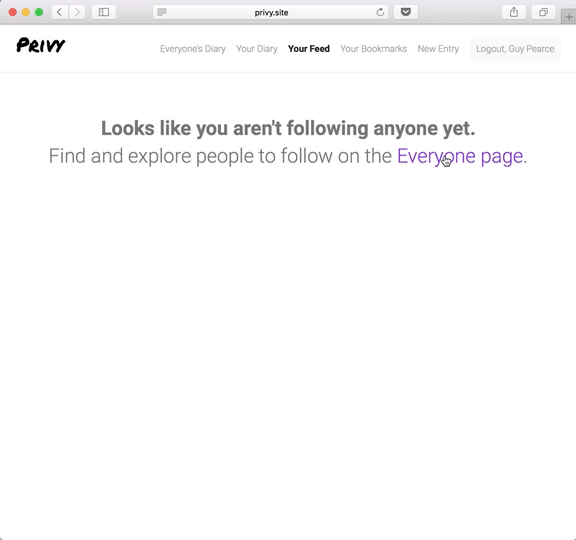
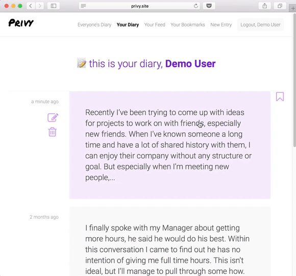
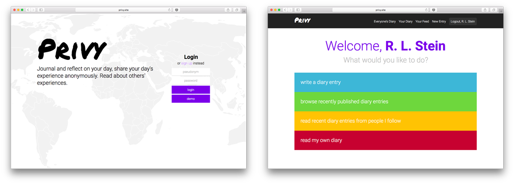
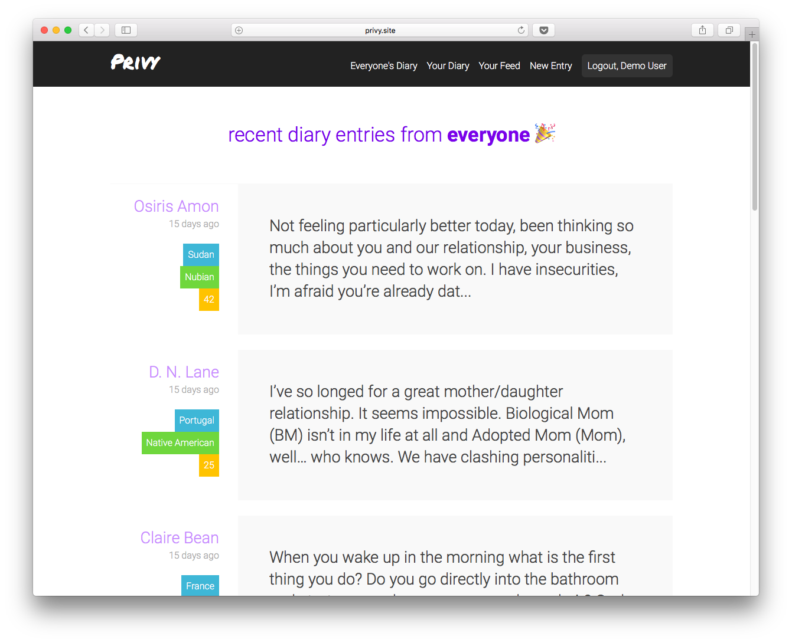
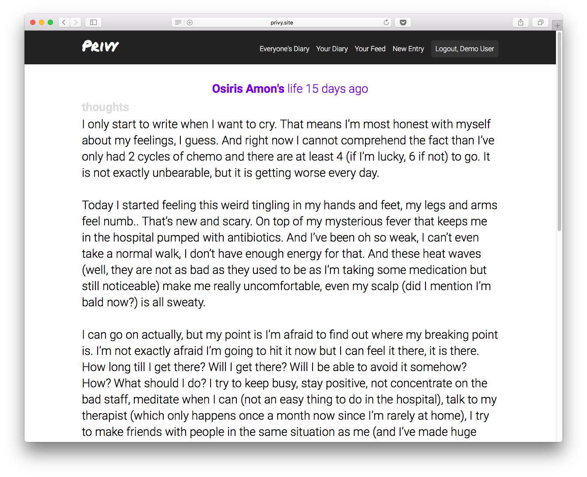

# Privy 
[Privy][live-link] is a single page, full-stack application that lets users publish an anonymous diary under a pseudonym. The application is implemented via an MVC architecture where Ruby on Rails acts as the Model and Controller and React is responsible for rendering the Views. The React frontend is also paired with a Redux flux architecture to manage state and ensure unidirectional data flow.

Privy is passion project born out of my own curiosity about how other people think and experience life, and out of a desire publish my own experiences for others to read.


## Features
  * Secure account login authentication and creation: passwords are hashed and salted via BCrypt on the backend, additional reinforced protection is provided on the frontend via protected routes in React.
  * Users can follow and read other people’s published diaries.
  * Users can save and bookmark diary entries to reference to later.
  * Users can post a reflection on an old entry they've written. (Other users can read an entry’s reflections, but they cannot write a reflection on entries they haven’t written.)

## Previews of Privy in action
### Browsing Entries


### Following Users


### Writing a personal reflection


### Deleting and Editing Diary Entries


 ### Login and Greeting page
  

 ### Viewing posts
  
To maintain DRY code, the same React component was used to render three different index views: the personal feed (showing entries based on a user's followers), the others users' entries (all entries writen by one user), the uer's own entries.

This was made possible by checking the URL pathname and params passed from the router and dynamically fetching content based on those specific props. 
```js
  componentWillReceiveProps(nextProps) {
    const { username, fetchEntries, fetchFeedEntries, currentUser, pathname } = nextProps;
    window.scrollTo(0, 0);

    if (this.props.pathname !== pathname ) {
      if (pathname === '/feed') {
        return fetchFeedEntries(currentUser.id) 
      } else if (username) {
        return fetchEntries(username);
      }
      return fetchEntries();
    }
  }

  typeOfIndexPage() {
    const { username, pathname } = this.props; 
    if (username) {
      return ` ${username}`;
    } else if (pathname === '/everyone') {
      return ' everyone';
    } 
    return ' people you follow';
  }
``` 

 ### Viewing a post
  
Utilizing SASS and its ability to create mixins also helped maintain DRY code for visual consistency and styling.  

## Project Design
Privy was designed and built in a two week period. View the original [proposal][dev-readme], which includes MVP features, an implementation timeline, and more extensive documentation.

## Future Implementations
  * Ability to search and read diaries from a general demographic, e.g. Italian women in their 40’s living in South Africa
  * The ability to highlight and save snippets of text users resonate with and like.
  * Adding unit, integration, and end-to-end tests

  [live-link]: http://wwww.privy.site/
  [dev-readme]: docs/README.md